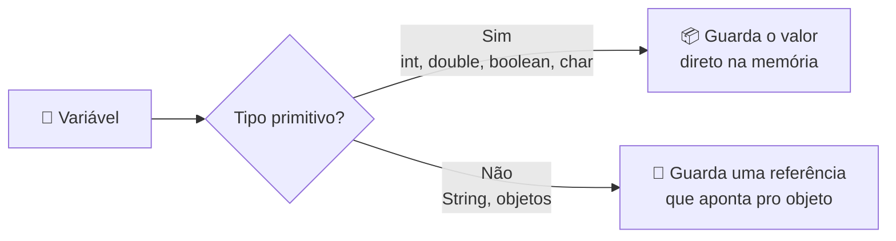
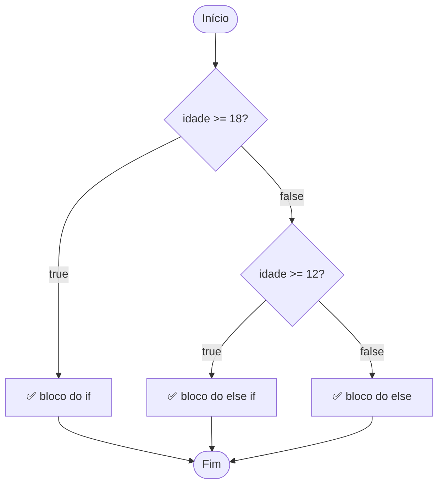
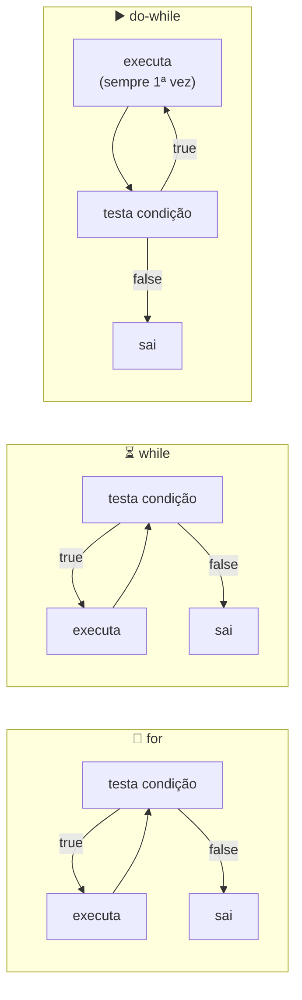
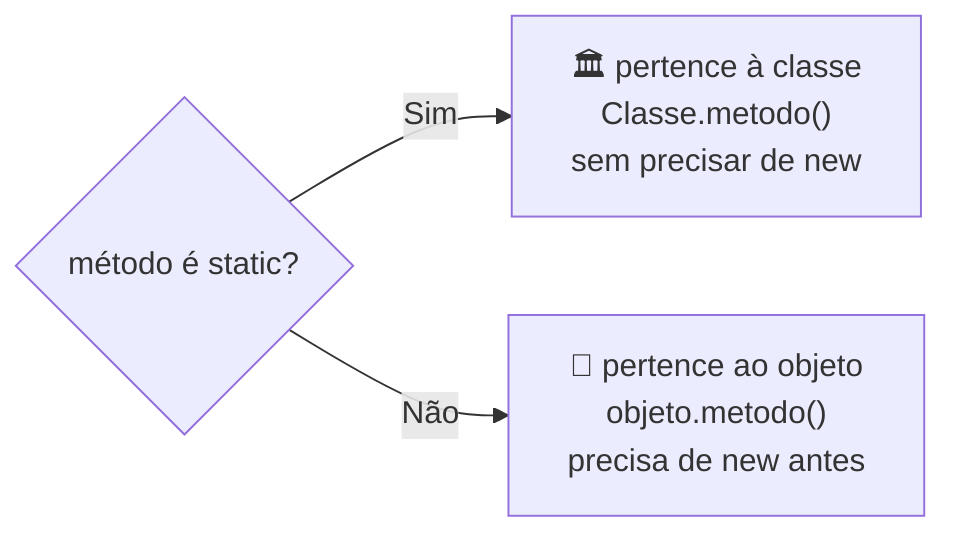
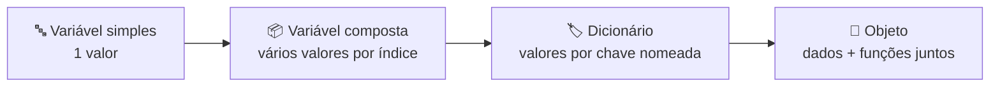
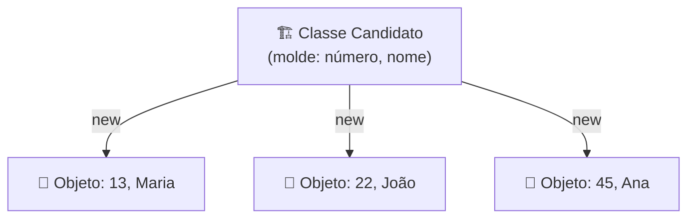
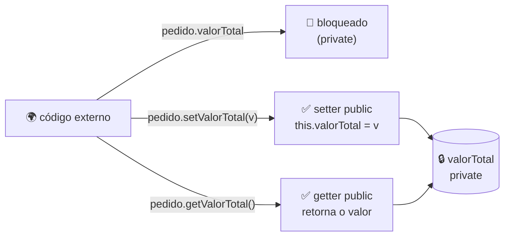
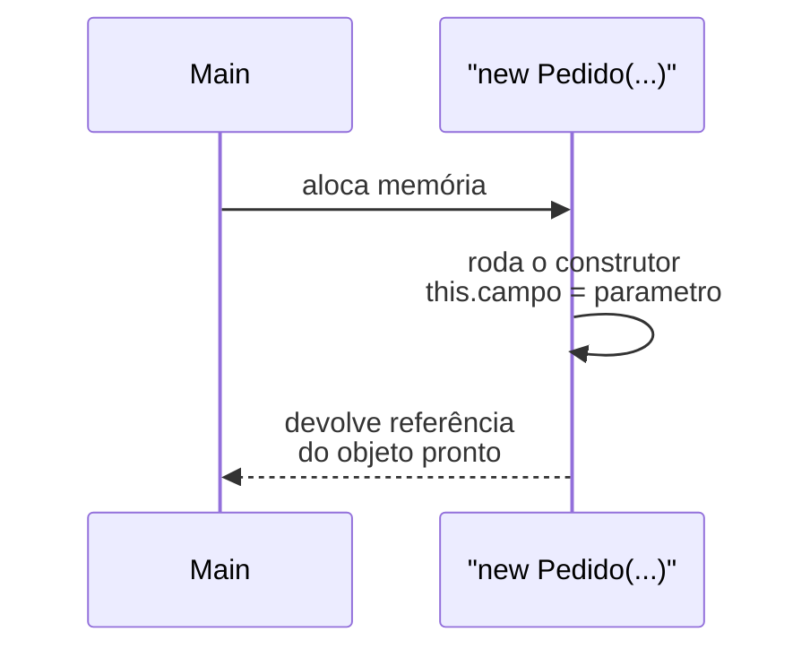
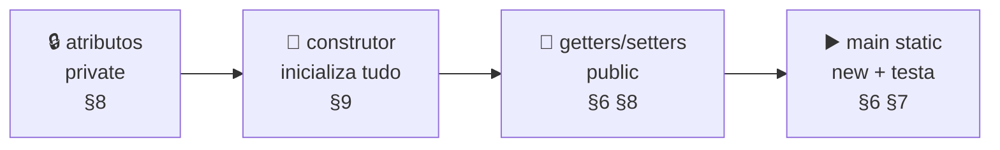

<h1 align="center">Guia Rápido de Java  <br>
folha de revisão — sintaxe e conceitos</h1>

<p align="center">
  
  
  
  
  
  
</p>

Referência de consulta rápida, não leitura sequencial. Use o sumário pra
pular direto no que precisa revisar antes de mexer em
[`exércicio1 - POO`](exércicio1%20-%20POO/).

```mermaid
flowchart LR
    A["🔤 Variáveis & Tipos"] --> B["⌨️ Entrada & Saída"]
    B --> C["🧮 Operadores"]
    C --> D["🔀 Condicionais"]
    D --> E["🔁 Loops"]
    E --> F["🛠️ Métodos"]
    F --> G["🏗️ Classe vs Objeto"]
    G --> H["🔒 Encapsulamento"]
    H --> I["🧱 Construtores"]
    I --> J["✅ Checklist POO"]
```



## Sumário

1. [Variáveis e tipos primitivos](#1-variaveis)
2. [Saída e entrada](#2-io)
3. [Operadores](#3-operadores)
4. [Condicionais](#4-condicionais)
5. [Loops](#5-loops)
6. [Métodos: `public`/`private`/`static`/retorno](#6-metodos)
7. [Classe vs. Objeto](#7-classe-objeto)
8. [Encapsulamento: `private` + getters/setters + `this`](#8-encapsulamento)
9. [Construtores](#9-construtores)
10. [Checklist do padrão POO usado nos exercícios](#10-pratica)

<h2 id="1-variaveis">1. Variáveis e tipos primitivos</h2>

Tipagem estática: valor precisa "caber" no tipo declarado.

```java
int idade = 22;
double preco = 19.90;
boolean ativo = true;
char letra = 'A';   // aspas simples
String nome = "Lucas"; // aspas duplas — não é primitivo, é objeto
```

| Tipo 🧩 | Categoria | Usa pra... | Exemplo |
|---|---|---|---|
| `int` | primitivo | quantidade, contagem | `int idade = 22;` |
| `double` | primitivo | dinheiro, medidas, decimais | `double preco = 19.90;` |
| `boolean` | primitivo | sim/não, flags | `boolean ativo = true;` |
| `char` | primitivo | 1 caractere | `char letra = 'A';` |
| `String` | referência (objeto) | texto | `String nome = "Lucas";` |



<h2 id="2-io">2. Saída e entrada</h2>

```java
System.out.println("Olá"); // com quebra de linha
System.out.print("Olá");   // sem quebra
System.out.println("Nome: " + nome + ", idade: " + idade);
```

```java
import java.util.Scanner;

Scanner sc = new Scanner(System.in);
String nome = sc.nextLine();
int idade = sc.nextInt();
double valor = sc.nextDouble();
```

| Método 📥 | Lê | Retorna |
|---|---|---|
| `sc.nextLine()` | linha inteira (com espaços) | `String` |
| `sc.next()` | uma palavra (até o espaço) | `String` |
| `sc.nextInt()` | número inteiro | `int` |
| `sc.nextDouble()` | número decimal | `double` |
| `sc.nextBoolean()` | `true`/`false` | `boolean` |

> ⚠️ Pegadinha comum: `nextInt()`/`nextDouble()` não consomem o `\n` do Enter —
> um `nextLine()` logo depois costuma vir "vazio". Resolve com um `sc.nextLine()`
> extra pra limpar o buffer.

<h2 id="3-operadores">3. Operadores</h2>

| Tipo ⛏️ | Operadores 🧑‍🏭 | Exemplo 🖍️ |
|---|---|---|
| Aritméticos | `+ - * / %` | `10 % 3` → `1` |
| Relacionais | `== != > < >= <=` | `idade >= 18` |
| Lógicos | `&&` `\|\|` `!` | `idade >= 18 && ativo` |
| Atribuição composta | `+= -= *= /=` | `soma += valor` |
| Incremento/decremento | `++` `--` | `i++` |

Pegadinha clássica: `=` (atribuição) ≠ `==` (comparação).

<h2 id="4-condicionais">4. Condicionais</h2>

```java
if (idade >= 18) 
{
     ... 
}

else if (idade >= 12) 
{ 
    ... 
}

else 
{ 
    ... 
}
```



`switch` — mesma variável, vários valores possíveis:

```java
switch (nota) 
{
    case 10: 
    System.out.println("Excelente"); break;

    case 5:  
    System.out.println("Mediano");  break;

    default: // caso que ocorre quando nenhum dos outros cases são atendidos!!
    System.out.println("Outro valor");
}
```

<h2 id="5-loops">5. Loops 🔁</h2>

| Loop | Quando usar |
|---|---|
| `for (int i = 0; i < n; i++)` | número de repetições conhecido/controlado |
| `while (cond)` | repete enquanto condição for verdadeira, número indefinido |
| `do { ... } while (cond)` | igual ao `while`, mas roda pelo menos 1 vez (checa no final) |
| `for (Tipo x : colecao)` | percorre array/coleção sem índice |



```java
for (int i = 0; i < 5; i++) 
{ 
    // código 
}

int tentativas = 0;
while (tentativas < 3) 
{ 
    tentativas++; // = enquanto tentativas forem menor que 3, o loop acontece.
}

int opcao;
do 
{ 
    opcao = sc.nextInt(); 
} 
while (opcao != 0);

double[] valores = {2.0, 4.0, 6.0};
for (double v : valores) 
{ 
    // código
}
```

Exemplo real de `for-each`:
[`CalculadoraMatematica.media()`](exércicio1%20-%20POO/java/4-CalculadoraMatematica/CalculadoraMatematica.java#L18-28).

<h2 id="6-metodos">6. Métodos: `public`/`private`/`static`/retorno</h2>

```java
public static double adicionar(double a, double b) { return a + b; }
```

| Peça ⛏️ | Significado 🧬 |
|---|---|
| `public` / `private` | quem pode chamar (ver tabela abaixo) |
| `static` | pertence à classe, não a um objeto — `Classe.metodo()` sem `new` |
| tipo antes do nome | retorno do método (`void` se não retorna nada) |
| `(...)` | parâmetros recebidos |

| Modificador | Acesso |
|---|---|
| `public` | qualquer classe |
| `private` | só a própria classe |



Base do encapsulamento: atributos `private` + métodos `public` controlando acesso.

`void` (`incrementarVotos()`) vs. retorno (`getVotos()`):
[`Candidato.java`](exércicio1%20-%20POO/java/7-Candidato/Candidato.java#L44-47).

<h2 id="7-classe-objeto">7. Classe vs. Objeto</h2>

- **Classe** = molde (atributos + métodos).
- **Objeto** = instância criada com `new`, com valores próprios.





```java
public class Candidato 
{
    private int numero;
    private String nome;
}

Candidato candidato = new Candidato(13, "Maria"); // parametros
```

Uma classe → N objetos, cada um com seu estado.
[`1-DiferencaClassesObjetos.md`](exércicio1%20-%20POO/md/1-DiferencaClassesObjetos.md).

Princípio da abstração (o que vira atributo): só o relevante pro problema.
[`3-PrincipioDaAbstracao.md`](exércicio1%20-%20POO/md/3-PrincipioDaAbstracao.md).


<h2 id="8-encapsulamento">8. Encapsulamento: `private` + getters/setters + `this`</h2>

Padrão fixo nos exercícios: atributo `private`, acesso só via getter/setter `public`.

```java
public class Pedido 
{
    private double valorTotal;

    public double getValorTotal() 
    { 
        return valorTotal; 
    }

    public void setValorTotal(double valorTotal) 
    { 
        this.valorTotal = valorTotal; 
    }
}
```



`this.valorTotal` = atributo do objeto · `valorTotal` = parâmetro. `this` desambigua.

Motivo: `private` bloqueia atribuição direta sem validação; o setter é o único ponto
de entrada (e onde entraria uma checagem, se precisasse).

Exemplos: [`Pedido.java`](exércicio1%20-%20POO/java/5-Pedido/Pedido.java) ·
[`Veiculo.java`](exércicio1%20-%20POO/java/6-Veiculo/Veiculo.java) ·
[`Candidato.java`](exércicio1%20-%20POO/java/7-Candidato/Candidato.java).

<h2 id="9-construtores">9. Construtores</h2>

Roda automaticamente no `new`, inicializa o objeto já completo.

```java
public Pedido(int numeroPedido, String nomeCliente, double valorTotal) 
{
    this.numeroPedido = numeroPedido;
    this.nomeCliente = nomeCliente;
    this.valorTotal = valorTotal;
}

Pedido pedido = new Pedido(1, "Lucas", 250.90); // new = atribuidor/constructor
```



Regras: mesmo nome da classe, sem tipo de retorno (nem `void`).

Caso especial — construtor **`private`** impede instanciar de fora:
[`CalculadoraMatematica.java`](exércicio1%20-%20POO/java/4-CalculadoraMatematica/CalculadoraMatematica.java#L8-11)
(classe "caixa de métodos estáticos", nunca vira objeto).
[`2-Construtores.md`](exércicio1%20-%20POO/md/2-Construtores.md).

<h2 id="10-pratica">10. Checklist do padrão POO usado nos exercícios</h2>

Toda classe em `exércicio1 - POO/java/` segue a mesma receita:



| Item ✅ | O que garante | Onde ver |
|---|---|---|
| Atributos `private` | ninguém altera o estado sem passar pelo objeto | §8 |
| Construtor | objeto nasce já com dados válidos | §9 |
| Getters/setters `public` | acesso controlado, ponto único de entrada | §6, §8 |
| `main` `static` | cria o objeto com `new` e testa o comportamento | §6, §7 |

Ver aplicado em [`Candidato.java`](exércicio1%20-%20POO/java/7-Candidato/Candidato.java).

Teoria completa por conceito: [`exércicio1 - POO/md/`](exércicio1%20-%20POO/md/).